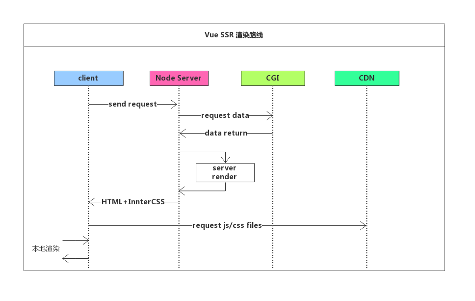
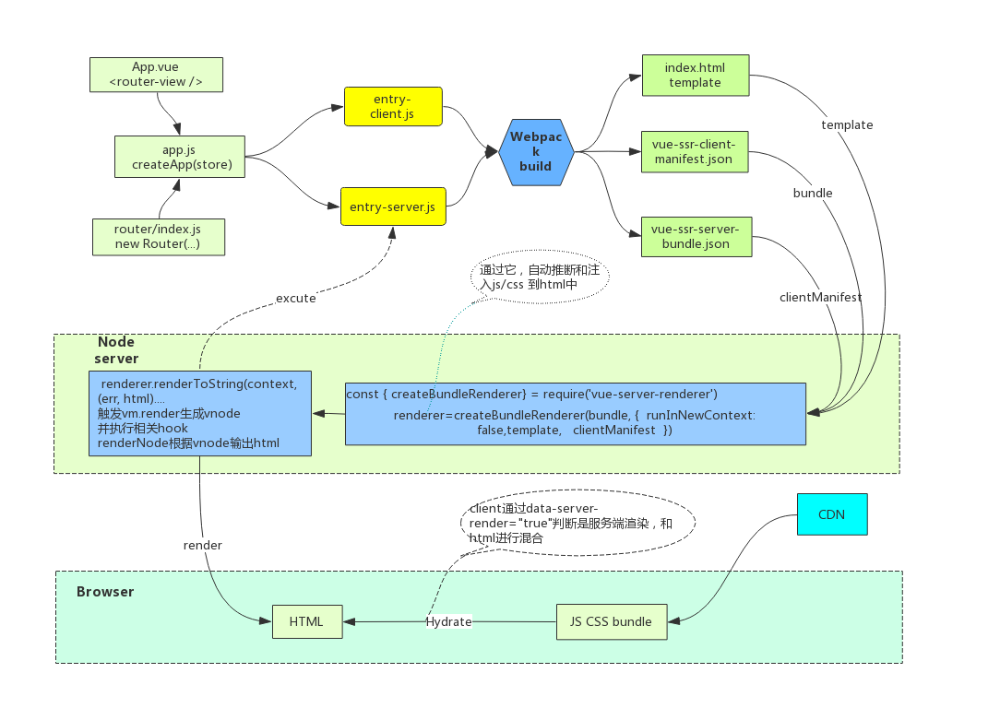

# 项目架构

## Vue SSR 渲染路线

SSR由nodejs服务器来直出页面，请求到达后端后，后端拉取cgi接口数据，根据直出bundle生成render对象，render对象将执行客户端代码构建VDOM，生成HTML string，填充进模板HTML，返回HTML资源，浏览器解析后加载CSS、JS资源，（在CSS加载结束后触发FP和FMP），Vue实例初始化，接管后端直出的HTML，页面可响应。




## 构建和执行流程

使用 webpack4 来打包我们的 Vue 应用程序。

```bash
├── webpack.base.config.js # 基本配置 (base config) 
├── webpack.client.config.js # 客户端配置 (client config)
├── webpack.server.config.js # 服务器配置 (server config)
```
具体webpack配置代码这里省略...

对于客户端应用程序和服务器应用程序，我们都要使用 webpack 打包 - 服务器需要「服务器 bundle」然后用于服务器端渲染(SSR)，
而「客户端 bundle」会发送给浏览器，用于混合静态标记。基本流程如下图：




