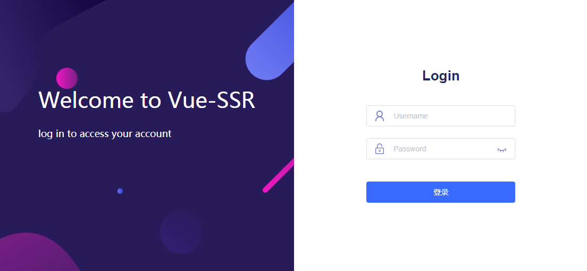
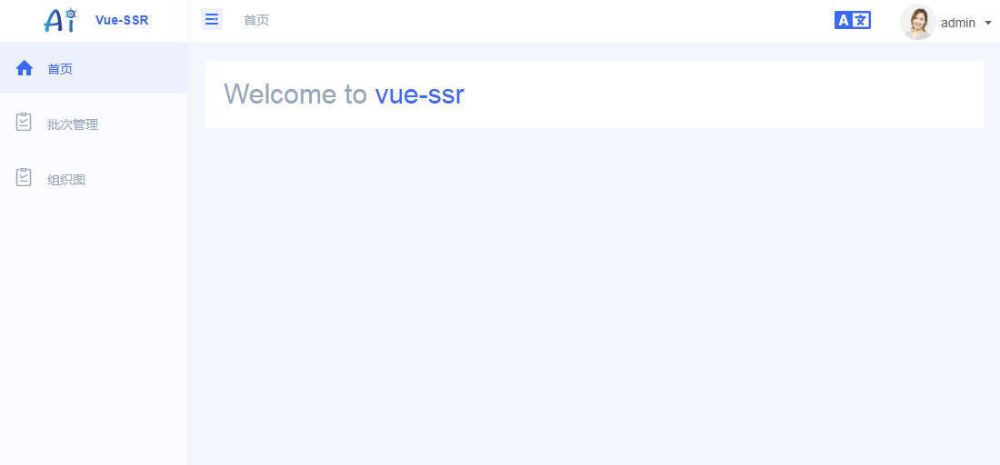
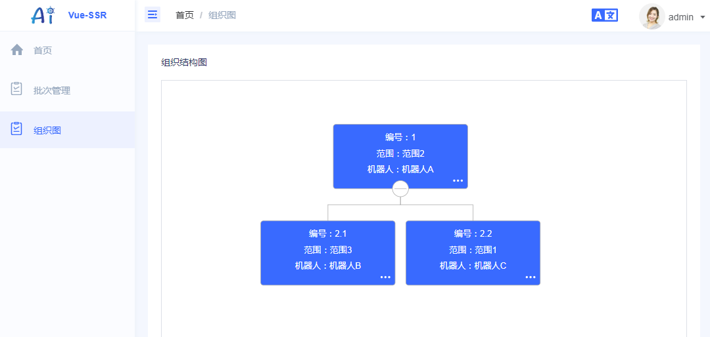

# 基础功能

### 特性

- 基于 Vue.js
- 服务端渲染
- 强大的路由功能，支持异步数据
- 支持懒加载
- 静态文件服务
- ES2015+ 语法支持
- 打包和压缩 JS 和 CSS
- HTML 头部标签管理
- 本地开发支持热加载
- 集成 ESLint
- 支持样式预处理器： SASS、LESS、 Stylus 

### 模板项目

#### 主要功能

- 登录 / 注销
- 权限验证
- 国际化多语言
- Svg Sprite 图标
- 错误日志
- 多环境
- 自适应收缩侧边栏
- 动态侧边栏（支持多级路由嵌套）
- 快捷导航(标签页)
- 组织图
- Echart
- .....

#### 截图

**登录**

**首页**

**组织图**

